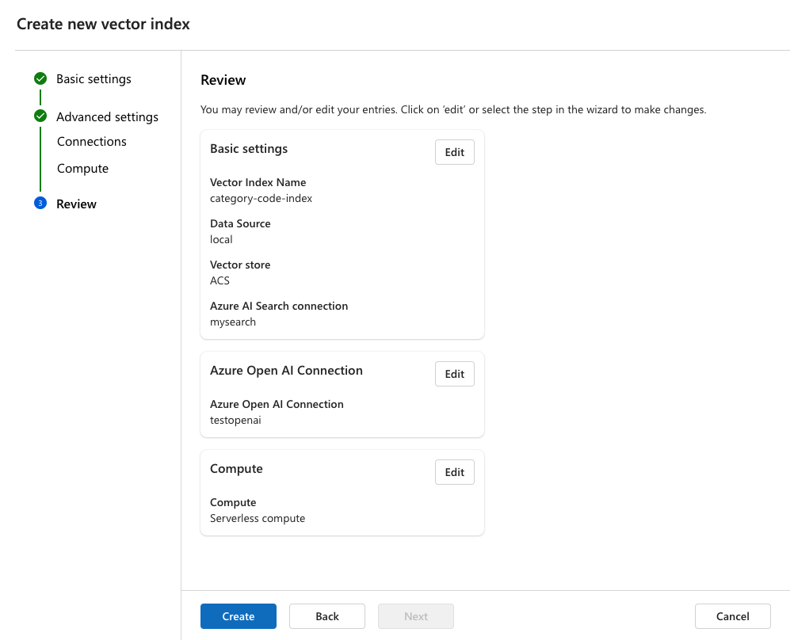

# Darpg-Challenge-2024

Based on the OpenSource project [Prompt-Flow](https://github.com/microsoft/promptflow)


## Retrieval Augmented Generation (RAG) Pattern

> RAG is an approach that enables you to harness the power of LLMs with your own data. Enabling an LLM to access custom data involves the following steps. First, the large data should be chunked into manageable pieces. Second, the chunks need to be converted into a searchable format. Third, the converted data should be stored in a location that allows efficient access. Additionally, it's important to store relevant metadata for citations or references when the LLM provides responses. [Read more here](https://learn.microsoft.com/en-us/azure/machine-learning/concept-retrieval-augmented-generation) <br><br><br>
 


## Prompt flow

> The process of crafting effective and efficient prompts is called prompt design or prompt engineering. [prompt flow](https://techcommunity.microsoft.com/t5/ai-machine-learning-blog/harness-the-power-of-large-language-models-with-azure-machine/ba-p/3828459) is the interactive editor of Azure Machine Learning for prompt engineering projects. [Read more here](https://learn.microsoft.com/en-us/azure/machine-learning/how-to-use-retrieval-augmented-generation?view=azureml-api-2)


## Prerequisites

- Valid Azure Subscrption
- Azure Resources to be create
   - Azure Machine learning workspace
   - Azure OpenAI 
        - Text Embedded Model Deployment
        - GPT 3.5 Turbo Model Deployment
   - Azure AI Search


## Configuring Infra

Once you created all the infra as per the [prerequisites](#prerequisites), Please proceed with the below steps

### Creating Connections

Create an [Azure AI Search Connection and OpenAI connections on Azure Machine Learning workspace](https://learn.microsoft.com/en-us/azure/machine-learning/prompt-flow/concept-connections?view=azureml-api-2) under promptflow menu, this is needed for us to consume in the below pipeline

 


### Creating Vector Index

Now we need to create a vector index by uploading the files as part of our requirement 

> **Note** Supported File Types: .md, .txt, .html, .htm, .py, .doc, .docx, .ppt, .pptx, .pdf, .xls, .xlsx. Any other file types will be ignored during creation.)

 
 
 



This will create and trigger a Job, which will do the basic steps of RAG Pattern 
- Crach and Chunk Data
- Generate the Embedding based on the Chunk Data
- Create the Vector Index on Azure AI Search and save those Embeddings
- Register the Vector Index as a Asset(AzureML Data)

    The content of this Asset file `MLIndex` will look like below - *We will use this in our code later at (`flow.dag.yaml`)*

    ```yaml
    embeddings:
        api_base: https://<openai-name>.openai.azure.com/
        api_type: azure
        api_version: 2023-07-01-preview
        batch_size: '16'
        connection:
            id: /subscriptions/<sub-id>/resourceGroups/<resource-group-name>/providers/Microsoft.MachineLearningServices/workspaces/<machine-learning-workspace-name>/connections/<openai-connection-name>
        connection_type: workspace_connection
        deployment: <text-embeddeding-deployment-name>
        dimension: 1536
        file_format_version: '2'
        kind: open_ai
        model: text-embedding-ada-002
        schema_version: '2'
    index:
        api_version: 2023-07-01-preview
        connection:
            id: /subscriptions/<sub-id>/resourceGroups/<resource-group-name>/providers/Microsoft.MachineLearningServices/workspaces/<machine-learning-workspace-name>/connections/<search-connection-name>
        connection_type: workspace_connection
        endpoint: https://<search-name>.search.windows.net
        engine: azure-sdk
        field_mapping:
            content: content
            embedding: contentVector
            filename: filepath
            metadata: meta_json_string
            title: title
            url: url
        index: <vector-index-name>
        kind: acs
        semantic_configuration_name: azureml-default
    ```
- Create Prompt Flow on Azure Machine learning workspace (Optional)

 


This Job will take around 10-20 mts to complete based on your file size.

### Replace the actual values in the code


| PlaceHolder | Description |
|--------|--------|
| `<sub-id>` | Subscription ID of your Azure machine learning workspace |
| `<resource-group-name>` | resource group name of your Azure machine learning workspace |
| `<machine-learning-workspace-name>` | Azure Machine learning workspace name |
| `<openai-name>` | Name of your azure openai resource  |
| `<search-name>` | Name of your azure ai search resource |
| `<text-embeddeding-deployment-name>` | Deployment name of your text embeddeding model inside Azure Open AI resource |
| `<gpt35-turbo-deployment-name>` | Deployment name of your gpt 35 turbo model inside Azure Open AI resource  | 
| `<vector-index-name>` | Name of your vector index in promptflow in Azure Machine learning workspace |
| `<search-connection-name>` | Name of your search connection in promptflow in Azure Machine learning workspace  |
| `<openai-connection-name>` | Name of your openai connection in promptflow in Azure Machine learning workspace 


## How to Run the code

1. Create your own codespace by clicking this button. Please allow 5 minutes for auto-configuration at first setup. 

   [](https://github.com/codespaces/new?hide_repo_select=true&ref=main&repo=749281611&devcontainer_path=.devcontainer%2Fdevcontainer.json&location=WestEurope)

1. Replace the [placeholders with actual values](#replace-the-actual-values-in-the-code) from your environment

1. Debug the Code using promptflow extension from vscode

   > **Note** If you face any issues related to python libraries like no module found, please install all the libraries mentioned in the `requirements.txt` file)
   

 
